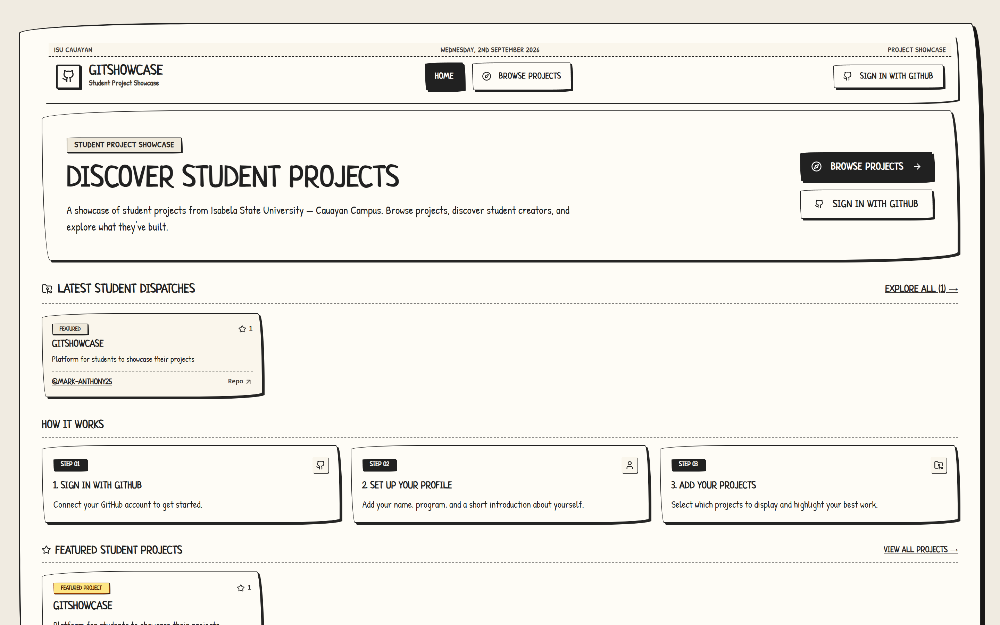
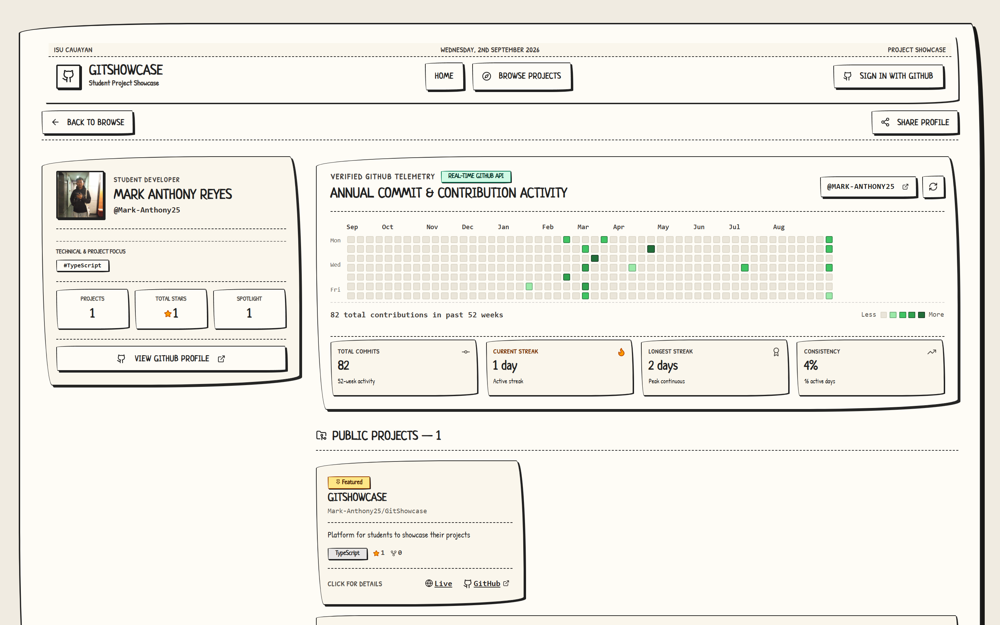
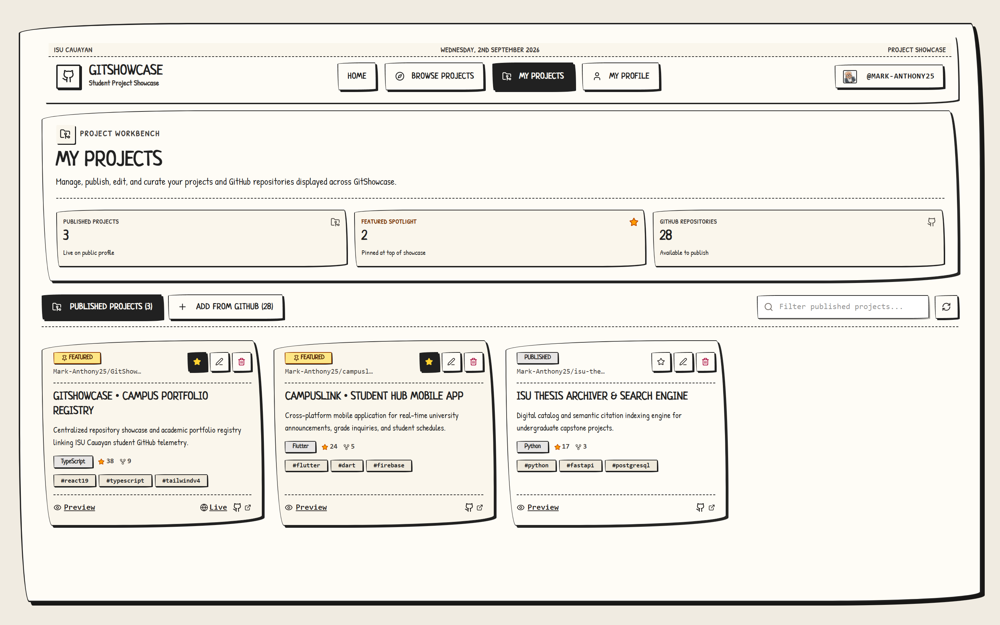
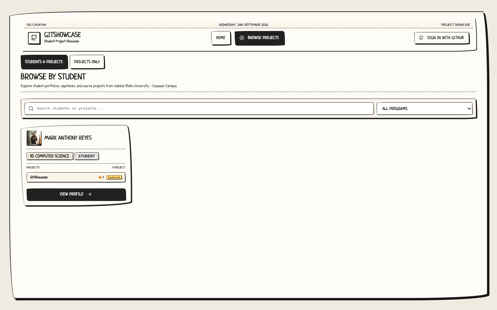
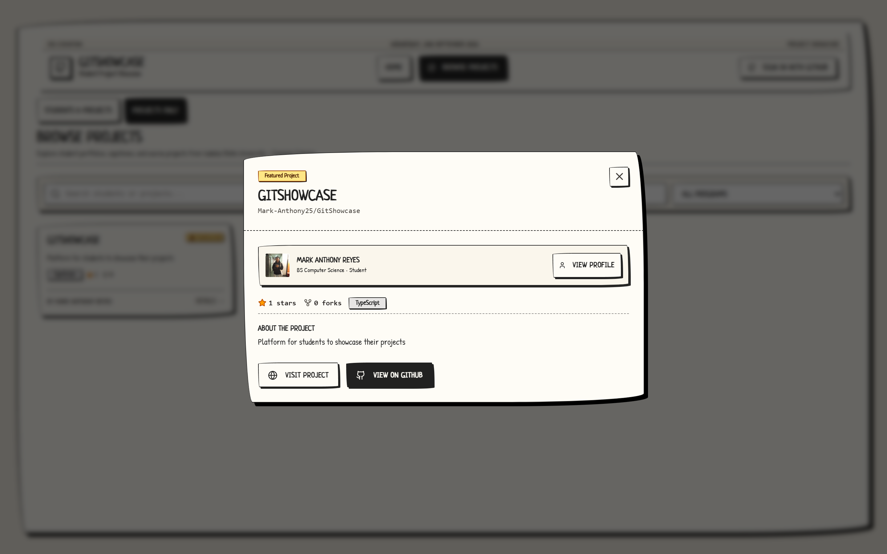
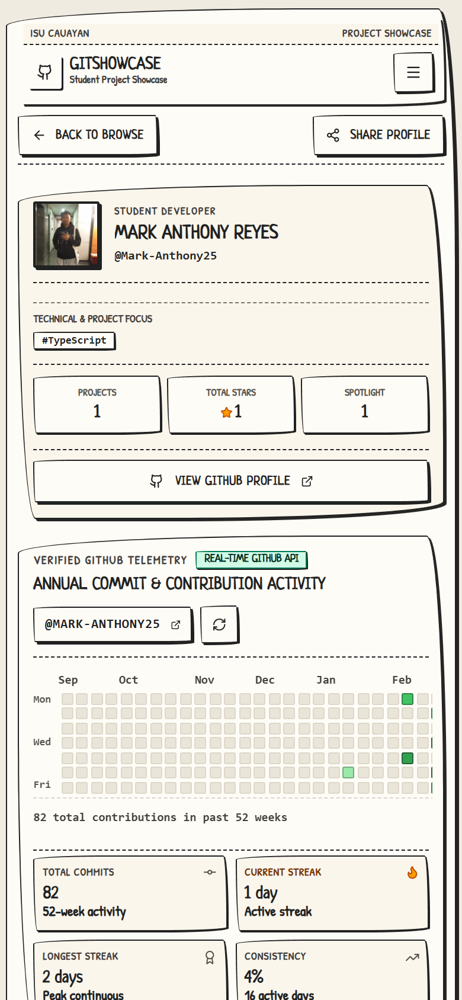

# GitShowcase • Isabela State University - Cauayan Campus

<div align="center">

[](https://react.dev/)
[](https://www.typescriptlang.org/)
[](https://vitejs.dev/)
[](https://tailwindcss.com/)
[](https://supabase.com/)
[](https://docs.github.com/)
[](LICENSE)

**A centralized student portfolio, capstone showcase, and GitHub repository registry tailored for computing students at Isabela State University — Cauayan Campus.**

[Explore Projects](https://gitshowcase.vercel.app/explore) • [Getting Started](#getting-started) • [Architecture](#architecture) • [Database & Security](#database--supabase-architecture) • [Optimization](#performance--resource-optimization)

</div>

---

## Overview

**GitShowcase** is a specialized portfolio and repository directory designed for computing students (BS Computer Science, BS Information Technology, BS Entertainment and Multimedia Computing, BS Accounting Information Systems) at **Isabela State University — Cauayan Campus**.

Traditional generic portfolio sites often require manual project metric entry and lack academic context. GitShowcase bridges academic identity with real-world developer output by directly integrating with **GitHub OAuth** and **Supabase**. Students can authenticate with one click, curate spotlight capstone repositories, display live GitHub metrics (stars, forks, languages, topics), and present a verified 52-week commit activity heatmap—all wrapped in an authentic, tactile **PaperCSS** newspaper editorial motif.

```
                  ┌────────────────────────────────────────┐
                  │              GitShowcase               │
                  │   Student Portfolio & Repo Registry    │
                  └───────────────────┬────────────────────┘
                                      │
        ┌─────────────────────────────┼─────────────────────────────┐
        ▼                             ▼                             ▼
 ┌──────────────┐              ┌──────────────┐              ┌──────────────┐
 │   Academic   │              │ Live GitHub  │              │ Verified 52W │
 │   Identity   │              │  Telemetry   │              │Commit Heatmap│
 │Program & Year│              │Stars & Forks │              │Streak Tracker│
 └──────────────┘              └──────────────┘              └──────────────┘
```

---

## Preview & Interface Showcase

### 1. Front Page / Discovery Feed
The front page highlights featured campus capstones, latest student dispatches, and quick onboarding action points for student creators.



---

### 2. Public Student Showcase Profile & 52-Week Commit Heatmap
Each student gets a shareable public URL (`/u/:username`) featuring their academic program, year level, verified 52-week GitHub contribution heatmap with real-time streak calculations, and curated project cards.



---

### 3. Student Project Workbench (Dashboard)
Authenticated student creators can manage published projects, pin featured capstones to their spotlight section, edit custom titles/descriptions, and import repositories directly from their connected GitHub account.



---

### 4. Public Campus Directory & Exploration
Search and filter student projects and developers across all computing degree programs (BSCS, BSIT, BSEMC, BSAIS, and other academic tracks) with instant toggle between student profiles and project grids.



---

### 5. Interactive Project Details Modal
View in-depth project descriptions, live GitHub telemetry (stars, forks, languages, topics, open issues), creator details, and direct links to live deployments and GitHub repositories.



---

### 6. Tactile Responsive Mobile Experience
Designed with an adaptive layout that renders on smartphones, tablets, and desktops using authentic hand-drawn paper borders and tactile elevation.

<div align="center">
  
</div>

---

## Core Features

- **GitHub OAuth & Academic Onboarding:**
  - One-click GitHub authentication via Supabase Auth.
  - Automatic profile seeding with GitHub username, name, and avatar.
  - Structured academic configuration: Degree program selector, year level, academic headline, and a strict 50-character bio constraint.

- **Verified 52-Week Commit Telemetry & Activity Heatmap:**
  - Real-time GitHub commit calendar rendered directly from the GitHub GraphQL and REST Events APIs.
  - Computes total annual commits, active streaks, longest historical streak, and coding consistency percentages.
  - Interactive day-by-day contribution count tooltips.

- **Curated Repository Showcase & Spotlight Pinning:**
  - Import repositories directly from the student's connected GitHub account.
  - Override default repository titles and descriptions with academic context, role explanations, or thesis defense summaries.
  - Pin featured capstones to top spotlight positions.

- **Campus Directory & Multi-Program Filtering:**
  - Full-text search matching student names, usernames, headlines, project titles, technologies, and descriptions.
  - Filterable by specific degree programs:
    - `BS Computer Science` (BSCS)
    - `BS Information Technology` (BSIT)
    - `BS Entertainment and Multimedia Computing` (BSEMC)
    - `BS Accounting Information Systems` (BSAIS)
    - `Other Programs` (Custom academic tracks)
  - Toggle between **Students & Projects** directory view and **Projects Only** grid view.

- **Live GitHub Statistics & Topic Tagging:**
  - Real-time resolution of repository stars, forks, primary programming language, repository topics, and commit timestamps.
  - Deep links to live web deployments and open-source GitHub repositories.

- **Multi-Tier Client Caching & Offline Fallback:**
  - Hot in-memory L1 cache paired with persistent `localStorage` L2 cache.
  - In-flight request deduplication preventing redundant GitHub API queries.
  - Resilient local offline data layer when Supabase credentials are in setup mode.

---

## Technology Stack

| Layer | Technology | Version | Description |
|---|---|---|---|
| **Frontend Framework** | React | `19.0.1` | Modern UI rendering with concurrent transitions |
| **Programming Language** | TypeScript | `~5.8.2` | Strict end-to-end type safety |
| **Build & Dev Tooling** | Vite | `^6.2.3` | Ultra-fast HMR and optimized production bundling |
| **Styling & Theme** | Tailwind CSS + PaperCSS | `v4.1.14` / `1.9.2` | CSS-first Tailwind configuration with hand-drawn paper aesthetic |
| **Motion & Animation** | Motion + Canvas Confetti | `12.23.24` / `1.9.4` | Micro-interactions, spring transitions, and milestone celebrations |
| **Iconography** | Lucide React | `^0.546.0` | Crisp SVG iconography matching newspaper line art |
| **Database & Auth** | Supabase | `^2.112.4` | PostgreSQL database, Row Level Security, GitHub OAuth |
| **External APIs** | GitHub REST & GraphQL | `2022-11-28` | User telemetry, repository statistics, contribution calendars |
| **Deployment** | Vercel | — | Edge CDN with immutable asset caching and SPA rewrites |

---

## Architecture

```
┌─────────────────────────────────────────────────────────────────────────────┐
│                             CLIENT BROWSER (SPA)                            │
│  ┌───────────────────────┐  ┌───────────────────────┐  ┌──────────────────┐ │
│  │   React 19 Frontend   │  │ Multi-Tier Cache Layer│  │ PaperCSS / Theme │ │
│  │  (Tailwind v4 + Vite) │  │(Memory + LocalStorage)│  │ (Editorial UI)   │ │
│  └───────────┬───────────┘  └───────────┬───────────┘  └──────────────────┘ │
└──────────────┼──────────────────────────┼───────────────────────────────────┘
               │                          │
               ▼                          ▼
┌──────────────────────────────┐ ┌────────────────────────────────────────────┐
│      VERCEL EDGE CDN         │ │              GITHUB PLATFORM               │
│ ┌──────────────────────────┐ │ │ ┌──────────────────┐  ┌──────────────────┐ │
│ │ SPA Routing & Rewrites   │ │ │ │ GitHub REST API  │  │ GitHub GraphQL   │ │
│ │ 1-Yr Immutable Caching   │ │ │ │ (Repos, Stats)   │  │ (52W Heatmap)    │ │
│ │ Security Headers         │ │ │ └──────────────────┘  └──────────────────┘ │
│ └──────────────────────────┘ │ └────────────────────────────────────────────┘
└──────────────┬───────────────┘
               │
               ▼
┌─────────────────────────────────────────────────────────────────────────────┐
│                             SUPABASE BACKEND                                │
│  ┌───────────────────────┐  ┌───────────────────────┐  ┌──────────────────┐ │
│  │     Supabase Auth     │  │   PostgreSQL Database │  │ Supabase Storage │ │
│  │  (GitHub OAuth 2.0)   │  │  (RLS + Auto Triggers)│  │ (Avatars Bucket) │ │
│  └───────────────────────┘  └───────────────────────┘  └──────────────────┘ │
└─────────────────────────────────────────────────────────────────────────────┘
```

---

## Project Structure

```text
gitshowcase/
├── docs/
│   └── screenshots/              # Real application interface captures
│       ├── home.png
│       ├── browse-projects.png
│       ├── project-details.png
│       ├── profile.png
│       ├── dashboard.png
│       └── mobile-view.png
├── public/                       # Static public assets
├── src/
│   ├── components/
│   │   ├── CommitHeatmap.tsx     # 52-week GitHub contribution heatmap & streak counter
│   │   ├── DashboardView.tsx     # Authenticated project workbench & management
│   │   ├── ExploreView.tsx       # Searchable student directory & project grid
│   │   ├── Header.tsx            # Newspaper masthead, navigation & auth dropdown
│   │   ├── LandingView.tsx       # Front page discovery, latest dispatches, and CTAs
│   │   ├── OnboardingModal.tsx   # Student academic info & bio setup dialog
│   │   ├── PublicProfileView.tsx # Shareable student profile (`/u/:username`)
│   │   └── SupabaseGuideModal.tsx# In-app SQL migration & OAuth setup assistant
│   ├── context/
│   │   └── AuthContext.tsx       # Supabase GitHub OAuth & profile state provider
│   ├── lib/
│   │   ├── cache.ts              # Multi-tier caching & request deduplication
│   │   ├── github.ts             # GitHub REST/GraphQL API & calendar parser
│   │   ├── programs.ts           # Academic degree programs configuration & matching
│   │   ├── showcaseStore.ts      # Profile & showcased projects store with RLS sync
│   │   ├── storage.ts            # Supabase avatar storage & CDN image transforms
│   │   └── supabase.ts           # Supabase client initialization & status checking
│   ├── App.tsx                   # Route resolution & application root shell
│   ├── index.css                 # PaperCSS and Tailwind CSS v4 design rules
│   ├── main.tsx                  # React 19 application entry point
│   └── types.ts                  # Shared TypeScript interfaces & types
├── supabase/
│   ├── migrations/               # PostgreSQL schema migrations & performance indexes
│   │   ├── 20260101000000_init_student_showcase.sql
│   │   └── 20260102000000_performance_indexes.sql
│   └── schema.sql                # Complete Supabase setup script (Tables, RLS, Triggers)
├── .env.example                  # Environment variables template
├── package.json                  # Dependencies and build scripts
├── tsconfig.json                 # TypeScript compiler configuration
├── vercel.json                   # Vercel deployment, caching & security headers
└── vite.config.ts                # Vite 6 + Tailwind v4 plugin configuration
```

---

## Getting Started

### Prerequisites

- **Node.js:** `v18.0.0` or later (Node `v22+` recommended)
- **Package Manager:** `npm`, `pnpm`, or `bun`
- **GitHub Account:** For student OAuth sign-in
- **Supabase Project:** (Free tier or self-hosted) for database and authentication

---

### Installation & Setup

1. **Clone the repository:**
   ```bash
   git clone https://github.com/Mark-Anthony25/GitShowcase.git
   cd GitShowcase
   ```

2. **Install dependencies:**
   ```bash
   npm install
   ```

3. **Configure Environment Variables:**
   Create a `.env` file in the project root based on `.env.example`:
   ```bash
   cp .env.example .env
   ```

   Populate your `.env` file with your credentials:
   ```env
   # Supabase Configuration (Supabase Dashboard -> Settings -> API)
   VITE_SUPABASE_URL=https://your-project-id.supabase.co
   VITE_SUPABASE_ANON_KEY=your-supabase-anon-key

   # GitHub OAuth Credentials (Supabase Dashboard -> Auth -> Providers -> GitHub)
   GITHUB_CLIENT_ID=your_github_client_id
   GITHUB_CLIENT_SECRET=your_github_client_secret

   # Local App URL
   APP_URL=http://localhost:3000
   ```

4. **Run Database Migrations in Supabase:**
   - Open your [Supabase Dashboard](https://supabase.com/dashboard).
   - Navigate to **SQL Editor** -> **New query**.
   - Copy the complete contents of [`supabase/schema.sql`](supabase/schema.sql) and click **Run**.
   - Navigate to **Authentication** -> **Providers** -> **GitHub**:
     - Enable GitHub Provider.
     - Enter your `Client ID` and `Client Secret` from your GitHub OAuth App.
     - Set the Authorization Callback URL provided by Supabase into your GitHub Developer settings (`https://<project-id>.supabase.co/auth/v1/callback`).

5. **Start the Development Server:**
   ```bash
   npm run dev
   ```
   Open [http://localhost:3000](http://localhost:3000) in your browser.

6. **Build for Production:**
   ```bash
   npm run build
   ```
   The production build will be emitted to the `dist/` directory.

---

## Environment Variables

| Variable | Required | Description |
|---|---|---|
| `VITE_SUPABASE_URL` | **Yes** | Supabase Project URL (e.g., `https://xyz.supabase.co`) |
| `VITE_SUPABASE_ANON_KEY` | **Yes** | Supabase Public/Anon API Key |
| `GITHUB_CLIENT_ID` | Optional | GitHub OAuth App Client ID (configured in Supabase) |
| `GITHUB_CLIENT_SECRET` | Optional | GitHub OAuth App Client Secret (configured in Supabase) |
| `APP_URL` | Optional | Host domain for OAuth redirect handling |

> [!NOTE]
> GitShowcase features an intelligent client-side fallback store. If Supabase is temporarily unconfigured or tables have not been created yet, the application will smoothly run using client-side offline storage while notifying you via the in-app setup assistant.

---

## Database & Supabase Architecture

GitShowcase is powered by Supabase PostgreSQL with airtight **Row Level Security (RLS)** and automatic auth triggers.

```
┌─────────────────────────────────┐
│           auth.users            │
└────────────────┬────────────────┘
                 │ (1 : 1 on delete cascade)
                 ▼
┌─────────────────────────────────┐       (1 : N)       ┌─────────────────────────────────┐
│         public.profiles         ├────────────────────►│    public.showcased_projects    │
├─────────────────────────────────┤                     ├─────────────────────────────────┤
│ id (UUID, PK -> auth.users)     │                     │ id (UUID, PK)                   │
│ github_username (TEXT, UNIQUE)  │                     │ profile_id (UUID -> profiles.id)│
│ full_name (TEXT)                │                     │ repo_full_name (TEXT)           │
│ headline (TEXT)                 │                     │ repo_url (TEXT)                 │
│ avatar_url (TEXT)               │                     │ custom_title (TEXT)             │
│ bio (TEXT, max 50 chars)        │                     │ custom_description (TEXT)       │
│ program (TEXT)                  │                     │ is_featured (BOOLEAN)           │
│ year_level (TEXT)               │                     │ display_order (INT)             │
│ is_onboarded (BOOLEAN)          │                     │ added_at (TIMESTAMPTZ)          │
│ created_at / updated_at (TZ)    │                     └─────────────────────────────────┘
└─────────────────────────────────┘
```

### Main Tables

1. **`profiles`:**
   Stores student identity, academic program, year level, headline, and 50-character bio.
   - Primary Key: `id` references `auth.users(id)` on delete cascade.
   - Unique: `github_username`.

2. **`showcased_projects`:**
   Stores student curated repositories with custom display titles, descriptions, and feature flags.
   - Foreign Key: `profile_id` references `public.profiles(id)` on delete cascade.

3. **`repo_stats_cache`:**
   Shared caching table storing enriched GitHub stars, forks, languages, and last commit dates.

### Automated User Trigger

When a student signs in with GitHub for the first time, a PostgreSQL trigger automatically initializes their student profile from GitHub OAuth metadata:

```sql
create or replace function public.handle_new_user()
returns trigger as $$
begin
  insert into public.profiles (id, github_username, full_name, avatar_url)
  values (
    new.id,
    coalesce(new.raw_user_meta_data->>'user_name', split_part(new.email, '@', 1)),
    coalesce(new.raw_user_meta_data->>'full_name', new.raw_user_meta_data->>'name'),
    new.raw_user_meta_data->>'avatar_url'
  )
  on conflict (id) do update set
    avatar_url = coalesce(excluded.avatar_url, profiles.avatar_url),
    full_name = coalesce(profiles.full_name, excluded.full_name);
  return new;
end;
$$ language plpgsql security definer;
```

### Row Level Security (RLS) Policies

- **Public Read Access:** `profiles`, `showcased_projects`, and `repo_stats_cache` are publicly readable by everyone (`using (true)`).
- **Owner Mutation Only:** Students can only insert, update, or delete their own profiles and showcased projects (`with check (auth.uid() = profile_id)`).

---

## Performance & Resource Optimization

GitShowcase is engineered for speed, low latency, and efficient API quota management:

1. **Multi-Tier Caching Layer (`src/lib/cache.ts`):**
   - **L1 In-Memory Cache:** `Map`-based hot cache for instant component switching without network lag.
   - **L2 Persistent LocalStorage:** Retains public directory data, profiles, and contribution calendars across browser reloads with designated TTLs:
     - `STATIC`: 24 Hours
     - `PUBLIC_DATA`: 10 Minutes
     - `USER_SESSION`: 5 Minutes
     - `CONTRIBUTIONS`: 15 Minutes
   - **Targeted Cache Invalidation:** Automatically clears related keys when a student updates their profile or adds/edits a project.

2. **In-Flight Request Deduplication:**
   - The `dedupeRequest` wrapper tracks concurrent asynchronous promises. If multiple components request the same user telemetry or repo stats simultaneously, only a single network fetch is dispatched.

3. **Supabase Image CDN Transformations:**
   - Avatar URLs can be transformed on-the-fly (`/render/image/public/`) with width, height, quality, and modern format conversions (`webp`, `avif`).

4. **Vercel Edge Asset Optimization (`vercel.json`):**
   - Static assets (`.js`, `.css`, `.png`, `.svg`, fonts) are served with `Cache-Control: public, max-age=31536000, immutable`.
   - `index.html` is served with `max-age=0, must-revalidate` for immediate version updates.

---

## Security Architecture

- **OAuth 2.0 Token Isolation:** GitHub provider tokens are handled securely through Supabase Auth sessions.
- **Strict Row Level Security (RLS):** Write and update operations strictly verify the authenticated user ID (`auth.uid() = profile_id`).
- **Input Sanitization & Length Restrictions:** Bio fields enforce a strict 50-character limit, and URLs are sanitized before rendering.
- **Security Headers:** Configured in `vercel.json`:
  - `X-Content-Type-Options: nosniff`
  - `X-Frame-Options: SAMEORIGIN`
  - `Referrer-Policy: strict-origin-when-cross-origin`

---

## Usage Guide

### For Student Developers
1. Click **Sign In with GitHub** on the navigation bar.
2. Complete the academic onboarding dialog (select your degree program, year level, and headline).
3. Navigate to **My Projects** (`/dashboard`).
4. Switch to the **Add from GitHub** tab and click **Publish** on the repositories you wish to feature.
5. Add custom titles and short role descriptions for each project.
6. Click the star icon to pin your top 2 capstones as **Featured Spotlight** projects.
7. Share your profile link (`https://gitshowcase.vercel.app/u/your-github-username`).

### For Faculty Advisers & Recruiters
1. Navigate to **Browse Projects** (`/explore`).
2. Use the search bar to locate specific thesis topics, algorithms, or student names.
3. Filter by academic degree program (e.g., *BS Computer Science* or *BS Entertainment and Multimedia Computing*).
4. Click on any project card to inspect the live telemetry, open issues, repository topics, and student creator profiles.

---

## Contributing

Contributions from students, faculty, and the open-source community are welcome!

1. Fork the repository (`https://github.com/Mark-Anthony25/GitShowcase/fork`).
2. Create your feature branch (`git checkout -b feature/amazing-feature`).
3. Commit your changes (`git commit -m "feat: add amazing feature"`).
4. Push to the branch (`git push origin feature/amazing-feature`).
5. Open a Pull Request.

---

## License

Distributed under the **MIT License**. See [`LICENSE`](LICENSE) for more details.

---

<div align="center">

Made with ☕ and passion by the student computing community of **Isabela State University — Cauayan Campus**.

</div>
